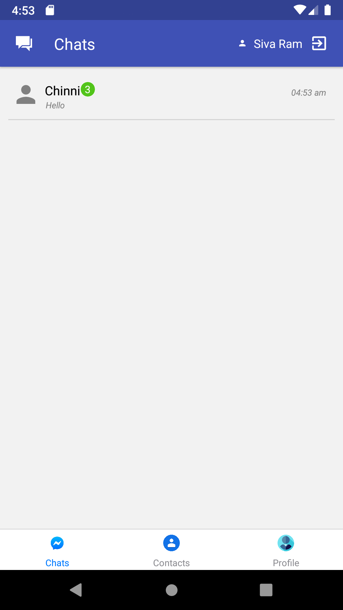
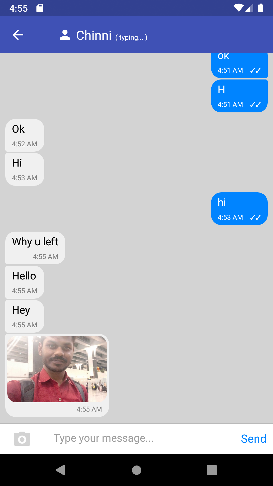
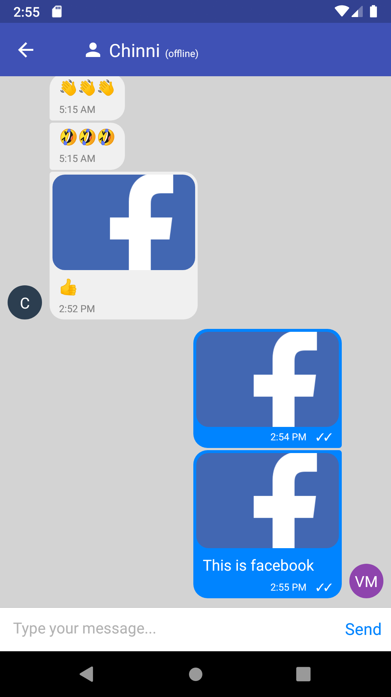
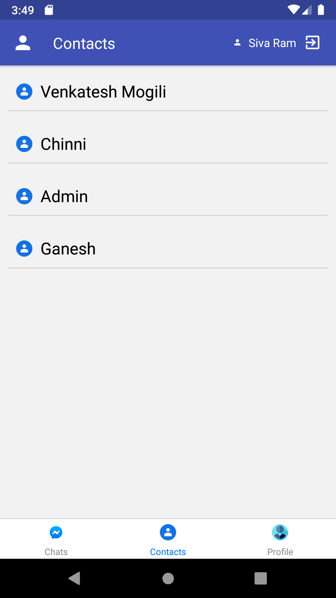
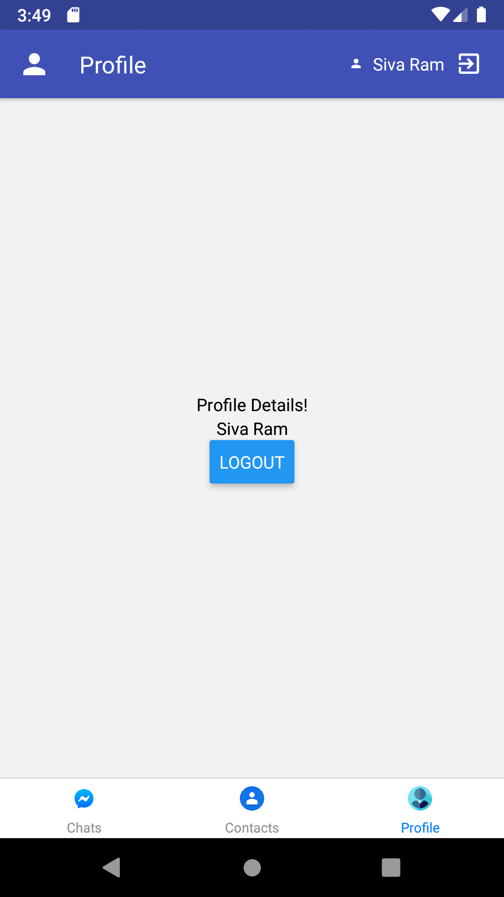

# MessengerApp
Messenger Application using React Native and Gifted Chat.

# Get Started

### Frontend setup
#### Change to mobile directory.
```cd mobile```

#### Install node packages.
```npm install```

#### Run below command to install app in emulator or mobile(make sure you already setup adb emulator Or connected to your mobile with USB and USB Debugging should be on and Allow install from unknown sources)
```npm run android```

#### Run the React Server
```npm run start```


### Backend setup
#### Change to backend directory.

```cd backend```

#### Install node packages.
```npm install```

#### Run Node Server
```npm start```


# Demo Screenshots
       